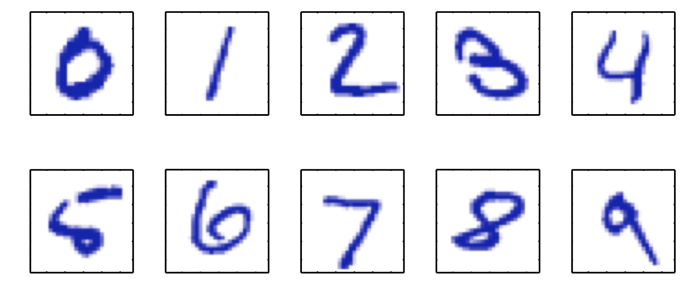
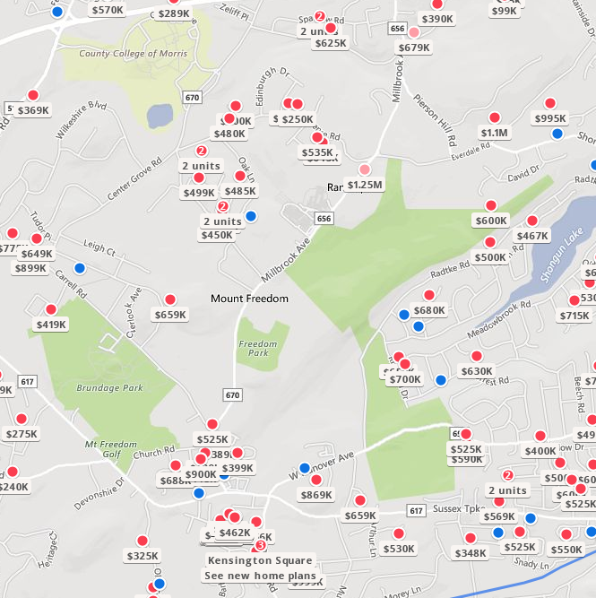
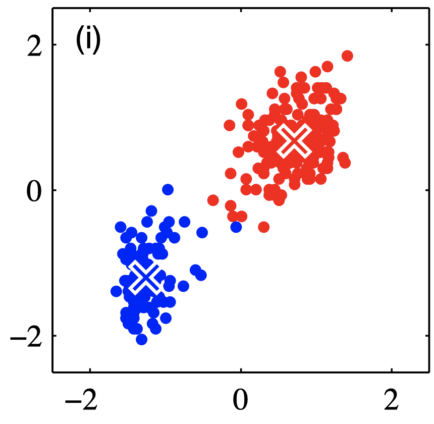

The performance of simpler machine learning algorithms depends heavily on the **representation** of the data they are given.  Each piece of, relevant to the problem, information that is included in the representation is known as a **feature**.

Modern ML systems **learn** the most suitable representations (still with a some help from data scientists) - an example is shown in the picture below. 

*Hierarchical Feature Learning*

In **supervised** learning we present a training set $\{ \mathbf{x}_1, \dots, \mathbf{x}_N \}$ together with their labels, the target vectors $\mathbf{y}$. 

*Examples from the MNIST training dataset*

Our task is to construct a model such that a suitably chosen loss function is minimized for a *different* set of input data, the so-called test set. The ability to correctly *predict* / *classify* when observing the test set, is called **generalization**.
 

*Birdseye view of home prices - Zillow predicts prices for similar homes in the same market.*

In unsupervised learning, we present a training set $\{ \mathbf{x}_1, \dots, \mathbf{x}_N \}$  without labels. We construct a partition of the data into some number $K$ of **clusters**, such that a suitably chosen loss function is minimized for a *different* set of input data, the so-called test set.

*Clustering showing two classes and the exemplars per class*