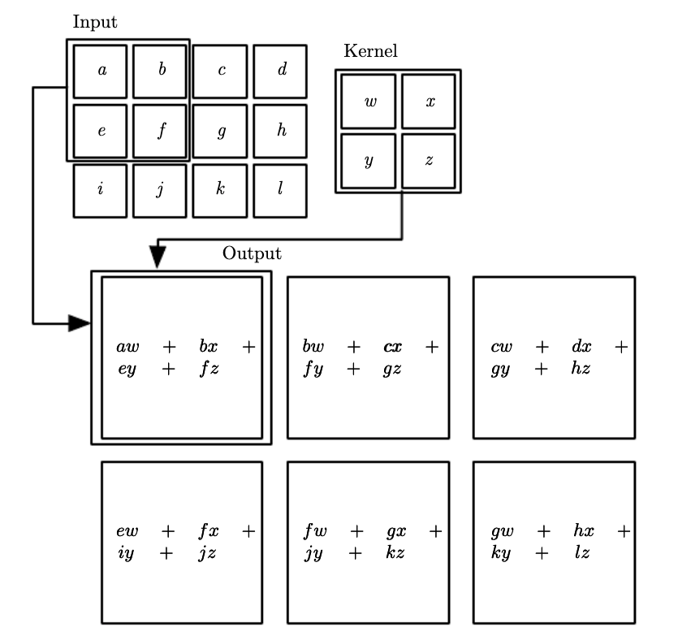
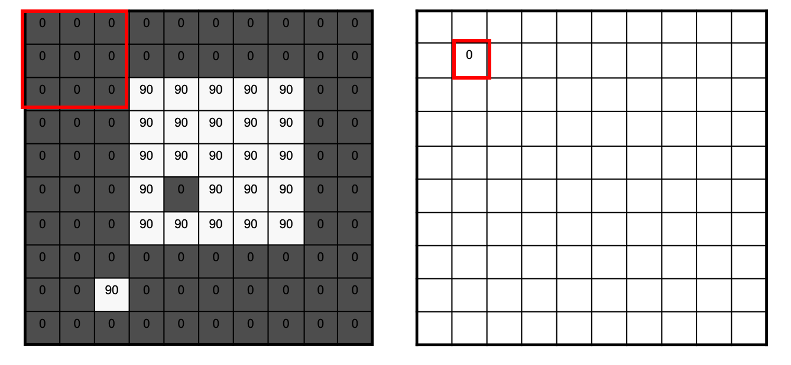
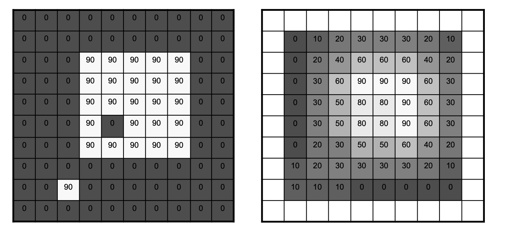
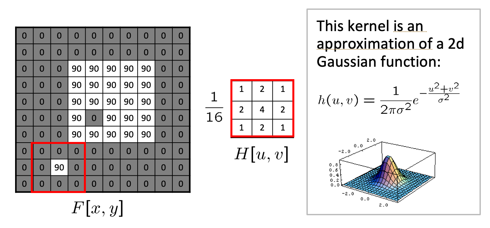

This section review many important to CNN operations that were inherited from digital signal processing.

## The Convolution & Cross-Correlation Operation

We will go through the signal processing operation of convolution giving emphasis to 2D convolution that we will soon meet at one of the per layer operations performed in Convolutional Neural networks.

Note that in ML frameworks the implementation of the convolution operation varies. First, the convolution operation in some frameworks is the *flipped* version - this is perfectly fine as the convolution operation is commutative. 

$S(i,j) = \sum_m \sum_n x(m, n)h(i-m,j-n) \\
          = \sum_m \sum_n x(i-m, j-n)h(m,n)$

where $x$ is the input of the convolution and $h$ is the kernel or filter typically of smaller spatial dimensions. 

Other frameworks don't even implemented convolution but they do the very similar **cross-correlation** operation below and they sometimes call it convolution to add to the confusion. TF implements **this** operation.

$S(i,j) = \sum_u \sum_v x(i+u, j+v)h(u,v)$

You should not be concerned with the framework implementation details, the thing that is important for you to grasp is the essence of the operation which is best explained using some simple examples. 

### Examples of simple 2D filtering operations

#### Moving Average

In the class we will go through the simplest possible 2D filtering operation where the as shown below. 

*First step in 2D MA Filtering*

*Completed 2D MA Filtering*

#### 2D Gaussian

The above filtering operations are obviously deterministic. We are given the filter but in CNNs as we will see in the next section we are estimating the filters. To keep the terminology aligned with the dense neural networks layers we will be denoting the filter with $\mathbf w$ - the weights that need to be learned through the training process. 