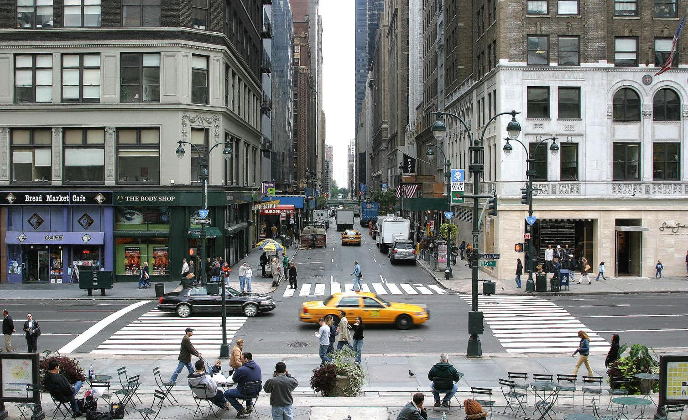
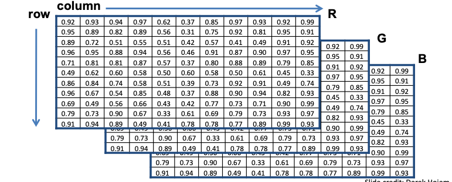

As elaborated [here](http://theconversation.com/how-do-our-brains-reconstruct-the-visual-world-49276), humans build up a more schematic version of the environment across eye fixations than was previously thought. This schematic version of the environment is typically known as **scene gist**. It contains conceptual information about the scene’s basic category – is it natural, human-made, a cityscape? – and general layout, maybe limited to a few objects and/or features. This schematic version of the environment is a far cry from the “picture in the head” scenario. But it’s this schematic information that guides us from one eye fixation to the next, during which more detailed information can be sampled. In the picture above, the brain will first detect the cityscape schematic and then process one of the scene fixations - e.g. the yellow cab.

As we will see shortly images-based datasets are almost exclusively used for instructive purposes in CNNs. The reason is simple. With images we are able to "see" the effects of a number of important algorithms that are related to classification, object detection etc. 

Focusing at the "fixation" stage of human vision, CNNs are biologically inspired from the structure that the neuroscientists David Hubel and Torsten Wiesel saw in the so called V1 region of the brain - the region at the back of our head that is responsible for the processing of visual sensory input signals coming from the eye's retina. 

<!-- CNNs capture three properties of the V1 region.

1. CNN layer feature maps are 2D structures in the same spirit to what the V1 processing architecture indicated. The  spatial map structure indicated.   -->

## Color images as functions

A grayscale picture can be seen as a function $f(x,y)$ of light intensities, where x and y are the rows and columns of pixels in the image. 

Usually we have border constraints in the range of the input pixels e.g. $x \in [a,b], y \in [c,d]$ but also in the output intensity values (typically 8-bit encoding is assumed that limits the values to [0, 255]). 

The city scape color image above can also be seen as a vector function:

$f(x,y)=  \begin{bmatrix} r(x,y) \\ g(x,y) \\ b(x,y)  \end{bmatrix}$

with its elements capturing the **channels** Red, Green and Blue functions, the mixture (superposition) of which can generate the pixel color of the original image. 

Please note the convention to refer to the **columns** $j$ of the matrix that represents each function with $x$ and to the rows $i$ with $y$. This may cause some confusion at first. 

