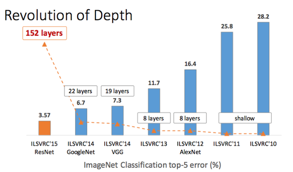
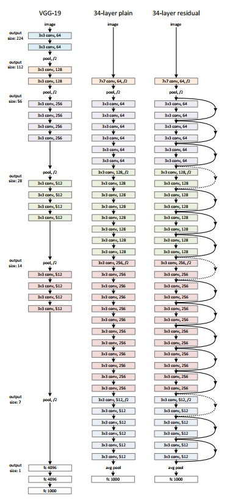

> NOTE: Use [this](https://towardsdatascience.com/neural-network-architectures-156e5bad51ba) article with [this](https://medium.com/@culurciello/analysis-of-deep-neural-networks-dcf398e71aae) update as a reference. This summary will be important to you as a starting point to develop your own up to date list of known ConvNets. 

What is instructive after reading the above reference is to be able to recall key design patterns and why those patterns came to be. We focus here on ResNet - today's workhorse in deep learning methods in computer vision.  The study of all of the details in the listed / linked architectures is **not** required for the final exam. 

## CNN Sizing

Sizing is an exercise that will help you how to specify hyperparameters in ```tf.keras``` such as the height, width, depth of filters, feature map sizes etc. Sizing is needed so that you can stitch all the layers together correctly. We will use an toy network for such exercise. 


The example CNN architecture above has the following layers:

* INPUT [32x32x3] will hold the raw pixel values of the image, in this case an image of width 32, height 32, and with three color channels R,G,B.
* CONV layer will compute the output of neurons that are connected to local regions in the input, each computing a dot product between their weights and a small region they are connected to in the input volume. This may result in volume such as [32x32x12] if we decided to use 12 filters.
* RELU layer will apply an elementwise activation function, such as the $max(0,x)$ thresholding at zero. This leaves the size of the volume unchanged ([32x32x12]).
* POOL layer will perform a downsampling operation along the spatial dimensions (width, height), resulting in volume such as [16x16x12].
* FC (i.e. fully-connected) layer, also known as dense, will compute the class scores, resulting in volume of size [1x1x10], where each of the 10 numbers correspond to a class score, such as among the 10 categories of CIFAR-10. As with ordinary Neural Networks and as the name implies, each neuron in this layer will be connected to all the numbers in the previous volume.

The impact of pading on the sizing of the produced feature map is shown in the following numerical example. The example is for [28x28x3] input layer but results can be extrapolated for [32x32x3]


### Number of parameters and memory




## ResNet



ResNets or residual networks, introduced the concept of the residual. This can be understood looking at an small residual network of three stages. The striking difference between ResNets and earlier architectures are the **skip connections**. Shortcut connections are those skipping one or more layers. The shortcut connections simply perform identity mapping, and their outputs are added to the outputs of the stacked layers. Identity shortcut connections add neither extra parameter nor computational complexity. The entire network can still be trained end-to-end by SGD with backpropagation, and can be easily implemented using common libraries without modifying the solvers.


Hinton showed that dropping out individual neurons during training leads to a network that is equivalent to averaging over an ensemble of exponentially many networks. Entire layers can be removed from plain residual networks without impacting performance, indicating that they do not strongly depend on each other. 

Each layer consists of a residual module $f_i$ and a skip connection bypassing $f_i$. Since layers in residual networks can comprise multiple convolutional layers, we refer to them as residual blocks. With $y_{i-1}$ as is input, the output of the i-th block is recursively defined as

$y_i = f_i(y_{i−1}) + y_{i−1}$

where $f_i(x)$ is some sequence of convolutions, batch normalization, and Rectified Linear Units
(ReLU) as nonlinearities. In the figure above we have three blocks. Each $f_i(x)$ is defined by

$f_i(x) = W_i^{(1)} * \sigma(B (W_i^{(2)} * \sigma(B(x))))$

where $W_i^{(1)}$ and $W_i^{(2)}$ are weight matrices, · denotes convolution, $B(x)$ is batch normalization and
$\sigma(x) ≡ max(x, 0)$. Other formulations are typically composed of the same operations, but may differ
in their order.

During the lecture we will go through [this](https://arxiv.org/pdf/1605.06431.pdf) paper analysis of the unrolled network to understand the behavior of ResNets that are inherently scalable networks.

ResNets introduced below - will be the network architectures used to implement object detection. They are not the only ones but these networks are the obvious / typical choice today and they can also be used in real time video streaming applications achieving significant throughput e.g. 20 frames per second. 

<iframe width="560" height="315" src="http://kaiminghe.com/icml16tutorial/icml2016_tutorial_deep_residual_networks_kaiminghe.pdf"></iframe>

<!-- ## DenseNet
Facebook AI Research (FAIR) used this network and won the best paper at the most prestigious computer vision conference: Computer Vision and Pattern Recognition (CVPR) in 2017.  -->
