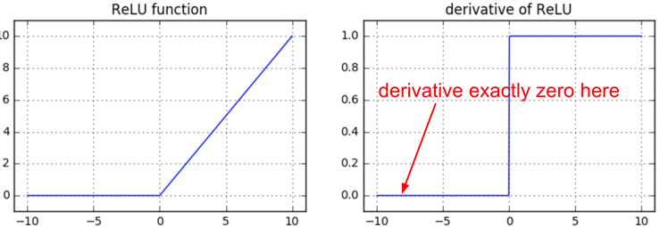
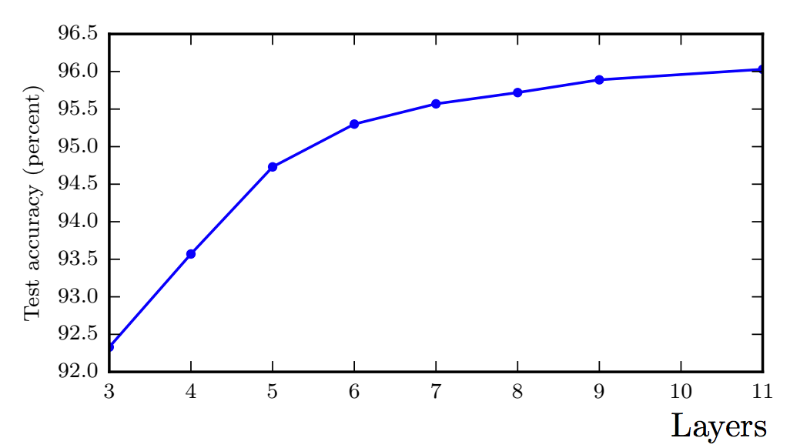

## Backprop behavior during training
As documented [here](https://medium.com/@karpathy/yes-you-should-understand-backprop-e2f06eab496b) and in Garon's textbook, you also need to be watchful of the effects of the various non-linear gates on the gradient flow. 

For **sigmoid gate**, if you are sloppy with the weight initialization or data preprocessing these non-linearities can “saturate” and entirely stop learning — your training loss will be flat and refuse to go down. If your weight matrix W is initialized too large, the output of the matrix multiply could have a very large range (e.g. numbers between -400 and 400), which will make all outputs in the vector z almost binary: either 1 or 0. But if that is the case, $z*(1-z)$, which is **local** gradient of the sigmoid non-linearity, will in both cases become zero (“vanish”), making the gradient for both x and W be zero. The rest of the backward pass will come out all zero from this point on due to multiplication in the chain rule.

For ReLU gates, if a neuron gets clamped to zero in the forward pass (i.e. z=0, it doesn’t “fire”), then its weights will get zero gradient. This can lead to what is called the “dead ReLU” problem, where if a ReLU neuron is unfortunately initialized such that it never fires, or if a neuron’s weights ever get knocked off with a large update during training into this regime, then this neuron will remain permanently dead. 

Tensorflow can create a computational graph from the DNN model specification (python). These graphs can be visualized on the web UI with Tensorboard. Use the playground when you first learn about DNNs to understand the principles but dive into the MNIST using Tensorflow use case to understand the Tensorflow mechanics and how to debug Tensorflow python scripts both syntactically and logically. Logical debugging should happen using Tensorboard visualizations. 

<!-- ## Performance of DNNs

### Impact of depth

### Regularization

   
In many cases we need to address overfitting by adding in the objective function some tunable penalty term that prevents it. Such penalty term is usually:

$\lambda J_{penalty} = \lambda \left(\sum_l W_{(l)}^2 \right) $

where $l$ is the hidden layer index and $W$ is the weight tensor. 
     -->
